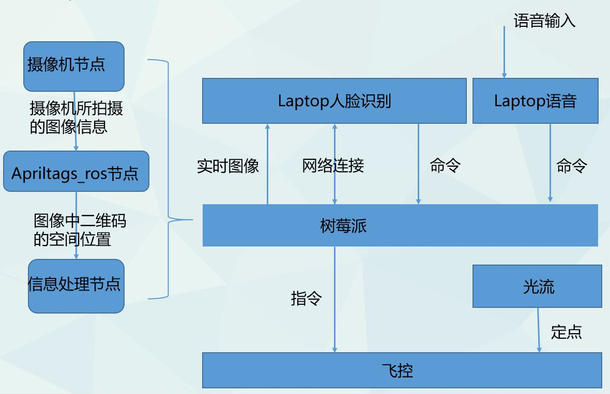

# ProjectManagement
Management history of the Intelligent Drone project

## 团队成果
https://youtu.be/Q0t_XF92gAM

## 关于Intelligent Drone
Intelligent Drone 项目使用树莓派和pixhawk，目标是实现人脸识别和跟踪，二维码识别和跟踪以及通过语音进行简单的人机交互。

团队指导老师：

- 陈浩耀

团队成员：

- 李慕琦
- 唐本旭
- 朱思汀
- 雷轩昂
- 全佳璇

## 项目整体框架

## 团队目前进展和问题
[Outcomes&Issues](./outcome&issue.md)

## 团队工作安排历史记录
- [2019-05-23工作计划](team/team_0523.md)
- [2019-06-02工作总结](team/team_0602.md)
- [2019-06-03工作计划](team/team_0603.md)
- [2019-06-08工作总结](team/team_0608.md)
- [2019-06-24工作计划](team/team_0624.md)
- [2019-07-05工作总结](team/team_0705.md)
- [2019-07-08工作计划](team/team_0708.md)
- [2019-07-14工作总结](team/team_0714.md)
## 个人工作安排历史记录
详情见personal文件夹内文件

## 各小组工作完成标准：

- 解决问题的文档记录(.md文件)
- 代码实现效果

## 其他注意事项
### Git的使用可参考
- [猴子都能懂的git入门](https://backlog.com/git-tutorial/cn/)
- [简明 Git 教程。浅显易懂，快速入门!](https://github.com/goto456/simple-git)

### Google编程规范
- [Google C++ Style Guide](https://google.github.io/styleguide/cppguide.html) 
  创新工场董事长兼 CEO 李开复曾经对 Google C++ 编码规范给予了极高的评价：“我认为这是地球上最好的一份 C++ 编程规范，没有之一，建议广大国内外 IT 研究使用。”
- [需要文档化的注释统一使用Doxygen的注释风格](http://www.doxygen.nl/)
  让自己的注释符合Doxygen的风格，将注释分为两种：需要文档化的注释（如文件、类、函数、枚举等的注释）; 不需要文档化的简单注释（如在代码块内部的简短解释）
  
  需要文档化的注释统一使用Doxygen的注释风格，即/*! … */和//!和//!< 三种方法
  
  不需要文档化的注释统一使用普通的注释风格，即2斜杠//
  
  这样又同时符合了Google C++风格（Google推荐/*…*/和//2种，上面的三种方式是从这2种演变而来）
