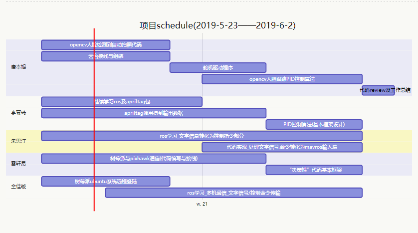

# 23/5-2/6 schedule


---


```gantt
    title 项目schedule(2019-5-23——2019-6-2)
    
    section 唐本旭
        opencv人脸检测到自动拍照代码: 2019-05-22, 4d
        云台接线与组装: 2019-5-22, 4d
        舵机驱动程序: 2019-5-26, 3d
        opencv人脸跟踪PID控制算法: 2019-5-27, 5d
        代码review及工作总结: 2019-6-1, 1d
    
    section 李慕琦
        继续学习ros及apriltag包: 2019-5-22 ,5d
        apriltag调用得到输出数据: 2019-05-22  , 7d
        PID控制算法(基本框架设计): 3d
    
    section 朱思汀
        ros学习_文字信息转化为控制指令部分: 2019-5-22, 10d
        代码实现_处理文字信号,命令转化为mavros输入端: 2019-05-27, 5d

    section 雷轩昂
        树莓派与pixhawk通信(代码编写与接线): 2019-5-22, 7d
        “决策性”代码基本框架: 2019-5-29, 3d

    section 全佳璇
        树莓派ubuntu系统远程登陆: 2019-5-22, 4d
        ros学习_多机通信_文字信号/控制命令传输: 2019-5-24, 8d
```


