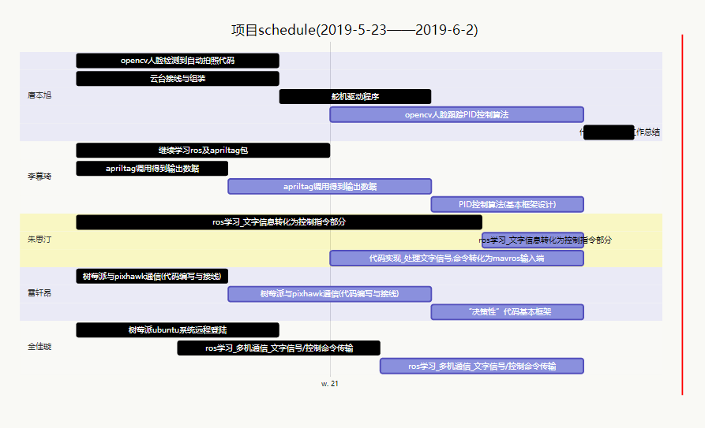

# 工作总结(2/6/2019)

标签（空格分隔）： davidben

---
#成果

##李慕琦
完成ros及apriltag包所有内容的学习

##唐本旭
完成opencv基本图像操作函数，人脸识别函数和方法的学习
完成通过opencv进行人脸识别和全身识别的代码编写
完成云台及舵机组装，舵机接线
完成舵机驱动代码编写

##朱思汀
1.语音识别任务完成，现在已经能够在Ubuntu下实现语音识别：具体过程为，用麦克风说话，在Ubuntu中的终端可以出现这句话的文字
2.完成ros，Python相关内容和命令行部分的学习

##全佳璇
1.完成ROS网络设置，ROS分布式多机通信，SSH通信，实现了树莓派与PC端的ROS多机通信和SSH通信
2.完成ROS节点，话题发布订阅相关知识的学习

#探索中

##朱思汀&全佳璇
1.ros多机通信的自动执行
2.语音输出结果的处理

目前遇到的困难：
1.如何把终端识别出来的文字通过ros通信传输到树莓派上
2.如何把文字变成指令指挥无人机的飞行
          
##雷轩昂
完成mavros以及mavlink学习
正在探索：
由于树莓派与pixhawk版本不断更新，多种通过mavros通信的方法均失败，目前正在尝试直接使用
mavlink

#未能按时完成的
##李慕琦
构建PID控制算法框架
##唐本旭
自动拍照后存储的照片从树莓派中导出
PID控制算法
##朱思汀&全佳璇
代码实现
#雷轩昂
“决策性”代码编写

