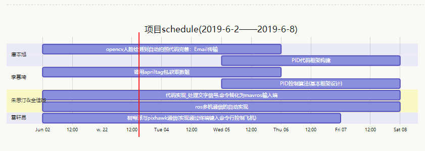

# 2/6-8/6 schedule

标签（空格分隔）： davidben

---

```gantt
    title 项目schedule(2019-6-2——2019-6-8)
    
    section 唐本旭
        opencv人脸检测到自动拍照代码完善：Email传输:2019-06-02, 4d
        PID代码框架构建: 2019-06-05, 3d
    section 李慕琦
        调用apriltag包,获取数据      : 2019-6-2 ,4d
        PID控制算法(基本框架设计)      :2019-06-05, 3d
    section 朱思汀&全佳璇
        代码实现_处理文字信号,命令转化为mavros输入端: 2019-06-02, 6d
        ros多机通信的自动实现: 2019-06-02, 6d
    section 雷轩昂
        树莓派与pixhawk通信(实现通过终端键入命令行控制飞机)    :2019-6-02, 5d
        
```


