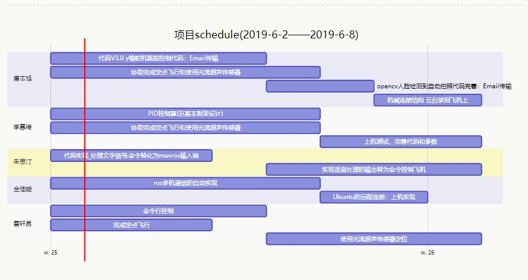

# 24/6-2/7 schedule



```gantt
    title 项目schedule(2019-6-2——2019-6-8)
    
    section 唐本旭
        代码V3.0 y轴舵机跟踪控制代码：Email传输:2019-06-24, 4d
        协助完成定点飞行和使用光流超声传感器: 2019-06-24, 5d
        opencv人脸检测到自动拍照代码完善：Email传输:2019-06-28, 2d
        机械连接结构 云台装到飞机上: 2019-06-30, 2d
    section 李慕琦
        PID控制算法(基本框架设计): 2019-6-24 ,5d
        协助完成定点飞行和使用光流超声传感器: 2019-06-24, 5d
        上机测试，完善代码和参数:2019-06-29, 3d
    section 朱思汀
        代码实现_处理文字信号,命令转化为mavros输入端: 2019-06-24, 3d
        实现语音处理的输出转为命令控制飞机: 2019-06-28, 4d
    section 全佳璇
        ros多机通信的自动实现: 2019-06-24, 5d
        Ubuntu的远程连接：上机实现: 2019-06-29, 2d
    section 雷轩昂
        命令行控制:2019-06-24, 4d
        完成定点飞行: 2019-06-24, 3d
        使用光流超声传感器定位: 2019-06-28, 4d
```


