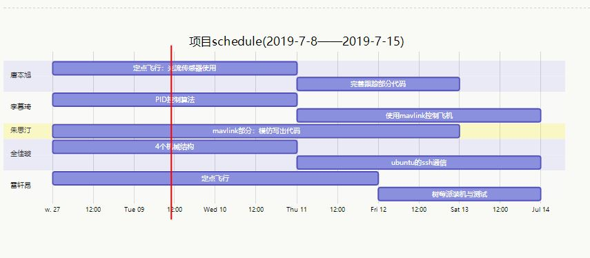

# 8/7-15/7 schedule

标签（空格分隔）： 大一立项 工作


---

```gantt
    title 项目schedule(2019-7-8——2019-7-15)
    
    section 唐本旭
        定点飞行：光流传感器使用: 2019-7-8, 3d
        完善跟踪部分代码: 2019-7-11, 2d
    section 李慕琦
        PID控制算法     :2019-07-08, 3d
        使用mavlink控制飞机: 2019-07-11, 3d
    section 朱思汀
        mavlink部分：模仿写出代码: 2019-7-8, 5d
    section 全佳璇
        4个机械结构: 2019-7-8, 3d
        ubuntu的ssh通信: 2019-7-11, 3d
    section 雷轩昂
        定点飞行: 光流传感器的使用: 2019-7-8, 4d
        
```